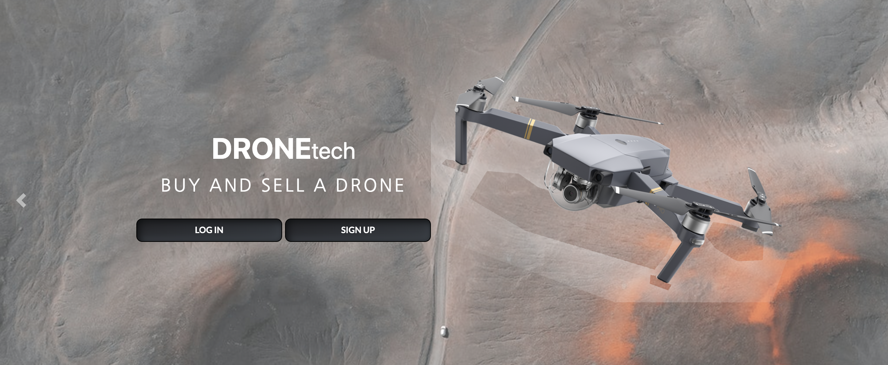
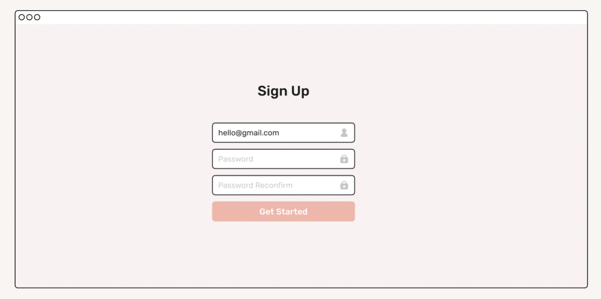

# DroneTech Marketplace

---
Deployed Link:

Github: 

https://github.com/EstherCsoke/rails-marketplace

---
### Tech Stack
- Ruby on Rails
- Javascript
- HTML
- Bootstrap 4
- CSS
- Puma
- Postgresql

- Deployment: Heroku

##### 1. Explain the different high-level components (abstractions) in your App.

DroneTech is designed using the Rails MVC design pattern. This framework is split into 3 separate layers of the user interface (Views), the control logic (Controllers) and the data model (Model). 

---
The Model for the data layer includes:

- Users - The data of the users information
- Listings - For data regarding item's from the listings
- Categories - The data for the category (drone type)
- Conversations - The conversation between a receiver and sender

- Messages - The data of the conversation messages

---
The Controller includes the following for the receiving requests from the browser and performs the specified actions

* The Listings controller is in charge of Listing crud operations such as creating a listing for a user, updating the listing, editing the listing, deleting the listing. As well as showing the listing by its ID and displaying all listings

* The Category controller is in charge of displaying the categories that are available for users.

*  The Conversations controller creates requests between the sender and receiver and is used to send a notification that there are unread messages

* The messages controller receives requests to create messages between the said user and receiver. 

* A payment controller is created to handle a success page of a listing purchase for the user. 

* The Users controller that is linked to devise is also used for the user profile and. 

---

Lastly, the Views are a visual representation of the page that users will see in their browser with usually components of the data from the model shown.
They include the pages for a user to access for the methods and controller. Such as the home page, the profile page, the listings pages and pages for messaging listing users etc. 

--- 

##### 2. List and describe any 3rd party services.

Amazon S3 [link](https://aws.amazon.com/).

Amazon S3 is an inexpensive storage infrastructure and was implemented to allow a place to store and retrieve image data of users. All objects are stored in a private bucket and allows the deployment of this app to somewhat abide by data protection regulations. 

Heroku [link](https://heroku.com/).

Heroku is a cloud platform that manages the hardware and server side of the application. It is used for the deployment of the marketplace.

Devise [link](https://github.com/heartcombo/devise).

Devise was used to create a complete MVC framework for the authentication of users for the marketplace. It allows the application to have more than one user and have authentication barriers.

Bootstrap 4 [link](https://getbootstrap.com/docs/4.0/getting-started/introduction/).

Bootstrap 4, a free front-end framework was used in the application for faster and easier website designs. It aids in the development of mobile friendly layouts for the site. It uses both HTML and CSS templates. 

##### 3.1. Identify the problem you’re trying to solve by building this particular marketplace App?
&& 
##### 3.2 Why is the problem identified a problem that needs solving?

Drones are currently growing in popularly due to the ever increasing advancement of technology and many various types of drones made available. In addition drones have become quite cost effective. The drone industry could grow to over 1 trillion dollars by 2040, as the automation of drones will be coming into effect. This in return will bring more drone users into the market and there will be more demand for areas to buy and sell. As this technology advances, drone enthusiasts may want to upgrade and sell their current drone - the droneTech website will provide them with a place to sell it. While drone marketplaces do exist in Australia. I believe the droneTech website's vision is to create a visually appealing website to buy and sell on and a minimalistic appeal that other websites may not have. Websites filled with many design features results in sensory overload for an individual that has been found to effect cognitive functioning and decision making. DroneTech's aim is to bring simplicity!

##### 4. Describe your project’s models in terms of the relationships (active record associations) they have with each other.

User:
* Can have many listings and all listing info will be deleted if the listing is deleted
* Can have an image attached for an avatar
* Can have many conversations and if deleted all the messages will be too

Listings:
* A listing belongs to a user on the site and will only be validated if the title, description, price, picture and category are chosen
* The listing can have only one picture attached
* The listing belongs to a one category
* The listing has an in_stock boolean that is changed to true when listed

Conversation
* A user belongs to a sender with a foreign key of the sender. It uses User as a class_name.
* A receiver also belongs to the conversation with the foreign key of receiver with a class name of User
* The conversation has many messages and the messages will be deleted if the conversation is destroyed.
* A user can be either a sender or a receiver and that is coded into the models relationship

Messages
* A message belongs to a conversation
* It belongs to the user, and validates the creation of the message body and the conversation id and the user id. There is also a message time associated with this. 
* There is a boolean indicating whether the message is read or not

Category
* The category has many listings

##### 5. Discuss the database relations to be implemented.

* The User will be associated with an id, password and email. The id of the user is implemented directly and indirectly throughout the database (db). The Listing table has a title, description price and in stock boolean and this applies for all listings. The listing needs a user id as other users can begin a message with the seller through a link on the listing page. The category db is associated with a kind of drone. There are 4 types of drones. When a user messages a seller, this created a relation to a conversation table. 

##### 6. Provide your database schema design.

##### 7. Provide User stories for your App.

 As a Buyer 
- I want to view a list of drones that are available to purchase so that I can see all the possible options.
- See a visual preview of the drone when scrolling through the list of products so I can make a quicker decision using the visual stimulus .
- See the price of the drone when scrolling through the list of available products so a decision can be made on whether it is affordable.
- To have an option to see more written details of the drone I am interested in to help in the decision process of the purchase. 
- To have an option to checkout and buy the drone listing straight away to same time and help with decision making by not storing everything into a shopping cart.
- To have an option to ask a question to the seller about the drone so that I may learn more about the product.
- To see the listings in the order in which they are posted to see the newest available items.
- To see when the drone listing was created to inform an opinion on the product by its availability time.
- To only have active listings shown to reduce having to contact the seller. 
- To be able to log in and upload information securely so that my private information isn't shown and there's a feeling of security.
- To have clear navigation on the website and not be hit with stimulation overload to confuse site navigation.

As a Seller I want to:
- To create my listing with ease to make the process less stressful.
- To be redirected to my listing so that I may view it after creation to check for errors.
- To upload a photo for my listing so that potential buyers may see my listing.
- To have active listings shown to buyers so that they may have a higher chance of viewing my listing.
- To post a lot of listings so that I could sell more than one drone at a time.
- To edit my listing so that I may make adjustments in case of spelling errors or uploading a better photo, or price change.
- To delete my listing quickly myself without any third party if there is a change of mind or issues

##### 8. Provide Wireframes for your App.
Home Page

  
Sign Up

 
 Profile
 
 
Listings Index 

 
Edit 

 
Create a Listing

 
Individual Listing

Mobile Home

Mobile Sign Up

Mobile Listing Index

Mobile Create Listing

Mobile Profile

  

##### 9. Describe the way tasks are planned and tracked in your project.

A planned sitemap was created to helped in understanding what needed to be created for the project
  

I was aided in the creation of a Trello Board where tasks were in order of delegating tasks. It tracked the order in which I was meant to perform tasks. 

I eventually added little bugs/ minor things in terms of styling. As it was my first time using Bootstrap it was helpful to keep track of these minor imperfections. 

For the design of the website, I took inspiration from the landscapes of Iceland. I wanted the site to have a strong bold look to it. Sticking with one image helped with sticking to a tracked design theme throughout the project. 
  

